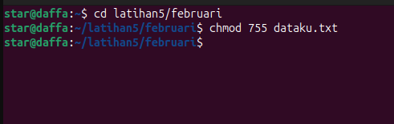

# Laporan_SO3_M.Daffa-al-haq.s_028_TK4B

<table>
        <tr>
            <th>Nama :</th>
            <td>M.Daffa' al haq.s</td>
        </tr>
        <tr>
            <th>Kelas :</th>
            <td>TK4B</td>
        </tr>
        <tr>
            <th>Nim :</th>
            <td>09030282327028</td>
        </tr>
        <tr>
            <th>Prodi :</th>
            <td>Teknik komputer</td>
        </tr>
</table>

Judul praktikum : sistem file 

1. Melihat peralatan I/O, character device, yang ada pada sistem komputer menggunakan command prompt  
     
   
2. Membuat sub direktori januari, februari dan maret sekaligus pada direktori latihan5  
     
   
3. Membuat file dataku yang berisi nama, nim dan alamat anda pada sub direktori januari dan copy-kan file tersebut ke sub    direktori februari dan maret  
     
     

4. Mengubah izin akses file dataku pada sub direktori januari sehingga group dan others dapat melakukan write  
     

5. Mengubah ijin akses file dataku pada sub direktori pebruari sehingga user dapat melakukan baik write, read maupun         execute, tetapi group dan others hanya bisa read dan execute  
     

6. Mengubah ijin akses file dataku pada sub direktori maret sehingga semua dapat melakukan write, read dan execute  
     

7. Menghapus direktori maret  
     

8. Mengubah kepemilikan sub direktori februari sehingga user dan group hanya dapat melakukan read, dan cobalah untuk         membuat direktori baru haha pada sub direktori februari  
     

9. Modifikasi umask dari file dataku pada sub direktori januari menjadi 027 dan berapakan nilai default-nya  
     

10. Membuat link dari file dataku ke file dataku.ini dan file dataku.juga dan dengan perintah list perhatikan berapa link     yang terjadi?  
      
